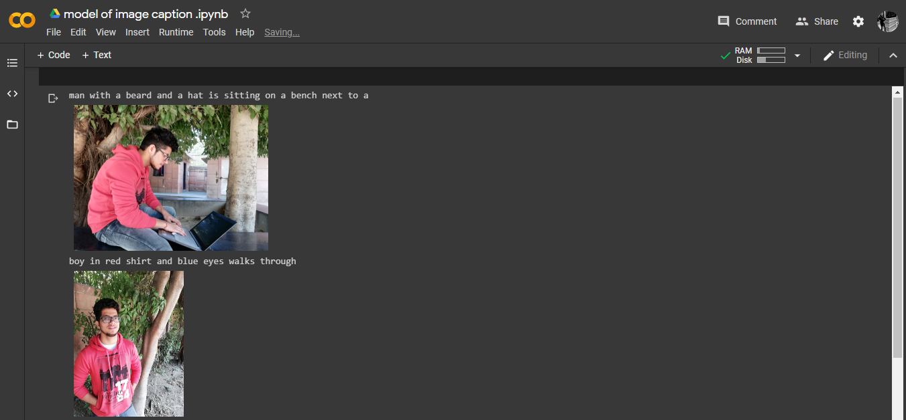
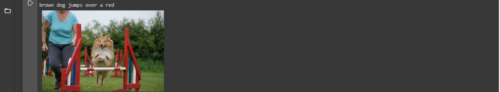
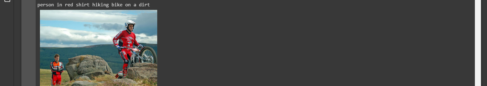

# Image Caption Generator

An AI-powered image captioning application using **ResNet50 (CNN)** for image feature extraction and **LSTM** for sequence generation. Built with **Gradio** for an interactive web interface.

## Features

- Upload any image and get an AI-generated caption
- Uses ResNet50 pre-trained on ImageNet for feature extraction
- LSTM-based language model for caption generation
- Clean, responsive Gradio web interface

## Model Architecture

- **Encoder**: ResNet50 (extracts 2048-dimensional image features)
- **Decoder**: LSTM with embedding layer for caption generation
- **Vocabulary**: Custom vocabulary built from Flickr8k dataset captions

## How to Use

1. Upload an image using the drag-and-drop interface
2. Click "Generate Caption"
3. The AI-generated caption will appear on the right

## Files

| File                | Description                                                    |
| ------------------- | -------------------------------------------------------------- |
| `app.py`            | Main Gradio application entry point                            |
| `app_gui.py`        | Original GUI with advanced features (TTS, URL input, examples) |
| `model_19.h5`       | Pre-trained Keras model (required for inference)               |
| `prepro_by_raj.txt` | Vocabulary and preprocessing data                              |
| `requirements.txt`  | Python dependencies                                            |

## Local Setup

```bash
pip install -r requirements.txt
python app.py
```

The app will start on `http://localhost:7860`.

## Dataset

Trained on the [Flickr8k Dataset](https://www.kaggle.com/datasets/adityajn105/flickr8k).

## Sample Predictions




